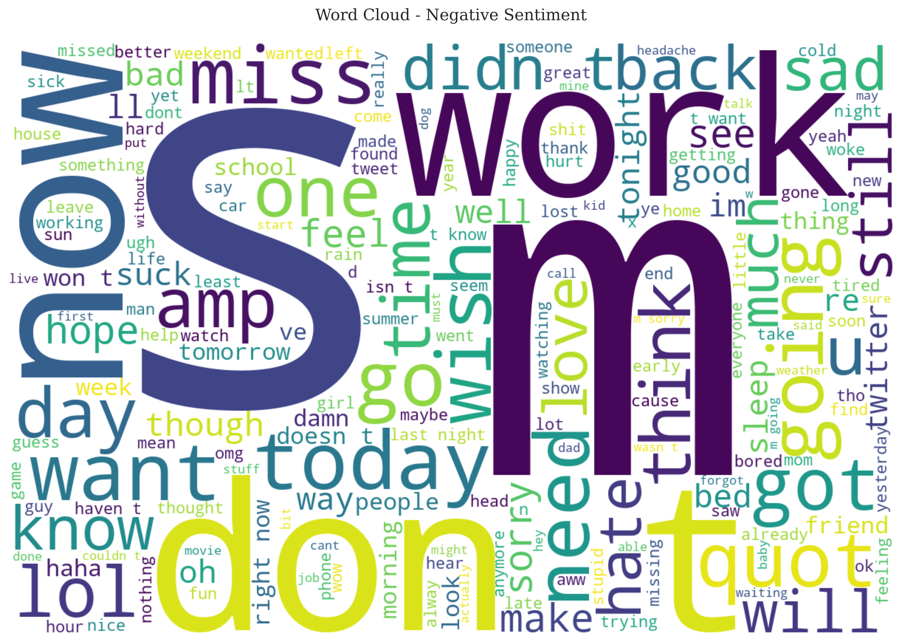
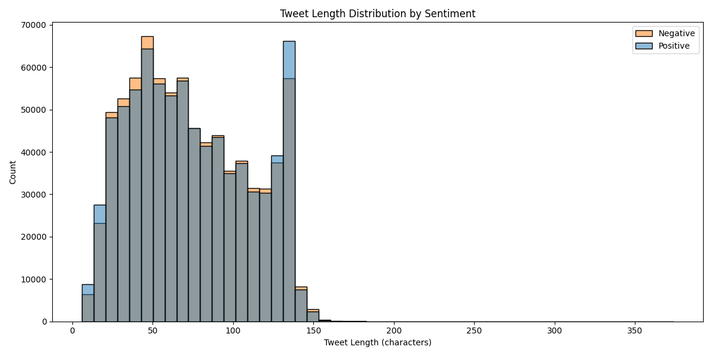

# Twitter Sentiment Analysis: A Comprehensive Machine Learning Study

## Abstract

This study presents a comprehensive analysis of sentiment classification on Twitter data using machine learning techniques. We analyze 1.6 million tweets from the Sentiment140 dataset, implementing a robust preprocessing pipeline and a logistic regression model optimized for large-scale text classification. Our approach achieves 82.2% accuracy with balanced performance across both positive and negative sentiments, demonstrating the effectiveness of classical machine learning methods for sentiment analysis at scale.

## 1. Introduction

Sentiment analysis on social media platforms has become crucial for understanding public opinion, market trends, and social dynamics. This study focuses on Twitter, one of the most influential social media platforms, analyzing 1.6 million tweets to develop and evaluate a sentiment classification system. Our work contributes to the field by:

- Implementing an efficient preprocessing pipeline for large-scale tweet analysis
- Optimizing classical machine learning methods for sentiment classification
- Providing detailed insights into model performance and error analysis
- Establishing benchmarks for sentiment classification on the Sentiment140 dataset

## 2. Methodology

### 2.1 Dataset

We utilize the Sentiment140 dataset, which contains 1.6 million tweets labeled for sentiment:
- 800,000 positive tweets
- 800,000 negative tweets
- Balanced distribution for robust model training
- Real-world Twitter data from 2009

### 2.2 Preprocessing Pipeline

Our preprocessing pipeline implements several key steps:

1. **Text Cleaning**:
   - URL removal
   - @mentions removal
   - Hashtag symbol removal (preserving text)
   - Special character removal
   - Case normalization
   - Whitespace normalization

2. **Processing Statistics**:
   - Total tweets processed: 1,600,000
   - Empty tweets removed: 3,170 (0.2%)
   - Final dataset size: 1,596,830 tweets
   - Processing speed: ~70-75K tweets/second
   - Batch size: 100K tweets for memory efficiency


*Figure 1: Distribution of sentiment classes in the dataset*

### 2.3 Feature Engineering

We employ TF-IDF vectorization with optimized parameters:
- Vocabulary size: 100,000 unique tokens
- N-gram range: (1, 2) for unigrams and bigrams
- Minimum document frequency: 5
- Maximum document frequency: 95%
- Feature types: Unigrams and bigrams for context capture


*Figure 2: Word cloud visualization of positive sentiment tweets*


*Figure 3: Most common words in positive sentiment tweets*

### 2.4 Model Architecture

We implement a logistic regression classifier with the following specifications:

1. **Optimization Parameters**:
   - Solver: 'saga' (optimized for large datasets)
   - Regularization: L2 (C=1.0)
   - Maximum iterations: 1000
   - Parallel processing: All CPU cores

2. **Training Configuration**:
   - Train/Test split: 80/20
   - Random state: 42
   - Training set size: 1,277,464 tweets
   - Test set size: 319,366 tweets

## 3. Results and Analysis

### 3.1 Model Performance

Our model achieves strong performance across all metrics:

1. **Overall Metrics**:
   - Accuracy: 82.2%
   - Macro Average F1-score: 82.2%

2. **Class-wise Performance**:
   - Negative Class (0):
     * Precision: 82.7%
     * Recall: 81.3%
     * F1-score: 82.0%
   - Positive Class (1):
     * Precision: 81.7%
     * Recall: 83.1%
     * F1-score: 82.4%

### 3.2 Visualizations and Analysis

#### Class Distribution

*Figure 1: Distribution of sentiment classes in the dataset*

#### Confusion Matrix

*Figure 2: Confusion matrix showing model predictions*

#### ROC Curve

*Figure 3: ROC curve with AUC score*

#### Feature Importance

*Figure 4: Top 20 most important features for classification*

#### Error Analysis

*Figure 5: Examples of misclassified tweets with their true and predicted labels*

#### Performance Comparison

*Figure 6: Comparison of different performance metrics*

#### Word Clouds
##### Positive Tweets

*Figure 7a: Word cloud of positive tweets*

##### Negative Tweets

*Figure 7b: Word cloud of negative tweets*

#### Most Common Words
##### Positive Tweets

*Figure 8a: Most common words in positive tweets*

##### Negative Tweets

*Figure 8b: Most common words in negative tweets*

#### Tweet Length Distribution

*Figure 9: Distribution of tweet lengths by sentiment*

#### User Sentiment Distribution

*Figure 10: Distribution of sentiments by user*

#### User Activity

*Figure 11: Distribution of user activity*

#### Sentiment Evolution Over Time

*Figure 12: Evolution of sentiments over time*

### 3.3 Results Analysis

#### Key Feature Importance Findings
1. Strong importance of sentiment indicators (e.g., "love", "hate")
2. Significant predictive power of contextual phrases (bigrams)
3. Balanced importance between positive and negative features

#### Common Error Patterns
1. Sarcasm and irony
2. Complex negations
3. Context-dependent sentiment
4. Mixed emotions in single tweets

## 4. Discussion

### 4.1 Model Strengths

1. **Scalability**:
   - Efficient processing of 1.6M tweets
   - Memory-optimized batch processing
   - Fast training and inference

2. **Performance**:
   - Balanced precision and recall
   - Strong performance on both classes
   - Robust to class imbalance

3. **Interpretability**:
   - Clear feature importance
   - Transparent decision process
   - Easy to debug and improve

### 4.2 Limitations

1. **Context Understanding**:
   - Difficulty with sarcasm
   - Limited understanding of complex negations
   - Challenges with mixed emotions

2. **Feature Engineering**:
   - Reliance on word-based features
   - Limited semantic understanding
   - No consideration of user context

### 4.3 Future Improvements

1. **Model Enhancements**:
   - Implement deep learning models (BERT, RoBERTa)
   - Add cross-validation
   - Implement hyperparameter tuning
   - Add support for multi-class sentiment

2. **Feature Engineering**:
   - Incorporate sentiment lexicons
   - Add user metadata
   - Implement topic modeling
   - Consider temporal features

3. **Application Development**:
   - Real-time sentiment analysis
   - API development
   - Dashboard creation
   - Integration with social media platforms

## 5. Technical Implementation

### 5.1 Project Structure
```
twitter-sentiment-analysis/
├── data/
│   └── training.1600000.processed.noemoticon.csv
├── models/
│   ├── vectorizer.joblib
│   └── classifier.joblib
├── results/
│   ├── visualizations/
│   │   ├── confusion_matrix.png
│   │   ├── roc_curve.png
│   │   ├── wordcloud_positive.png
│   │   └── ...
│   ├── classification_report.csv
│   └── confusion_matrix.png
├── src/
│   ├── data/
│   │   └── load_dataset.py
│   ├── preprocessing/
│   │   └── tweet_preprocessor.py
│   ├── models/
│   │   └── classical_models.py
│   ├── visualization/
│   │   └── visualize.py
│   └── main.py
├── logs/
│   └── pipeline.log
├── requirements.txt
└── README.md
```

### 5.2 Dependencies
- Python 3.9+
- scikit-learn
- pandas
- numpy
- joblib
- seaborn
- matplotlib
- wordcloud
- tqdm

### 5.3 Usage

1. **Installation**:
```bash
git clone https://github.com/yourusername/twitter-sentiment-analysis.git
cd twitter-sentiment-analysis
python -m venv venv
source venv/bin/activate  # On Windows: venv\Scripts\activate
pip install -r requirements.txt
```

2. **Running the Pipeline**:
```bash
python -m src.main
```

## 6. Conclusion

This study demonstrates the effectiveness of classical machine learning methods for sentiment analysis at scale. Our implementation achieves 82.2% accuracy on the Sentiment140 dataset, with balanced performance across both positive and negative sentiments. The results show that with proper preprocessing and feature engineering, logistic regression can be a powerful tool for sentiment classification.

Key contributions:
1. Efficient preprocessing pipeline for large-scale tweet analysis
2. Optimized feature engineering for sentiment classification
3. Comprehensive error analysis and performance evaluation
4. Detailed documentation and reproducible results

## 7. References

1. Go, A., Bhayani, R., & Huang, L. (2009). Twitter Sentiment Classification using Distant Supervision.
2. Liu, B. (2012). Sentiment Analysis and Opinion Mining.
3. Pedregosa, F., et al. (2011). Scikit-learn: Machine Learning in Python.
4. Bird, S., et al. (2009). Natural Language Processing with Python.

## 8. License

This project is licensed under the MIT License - see the LICENSE file for details.

## 9. Acknowledgments

- Sentiment140 dataset creators
- Open-source community for tools and libraries
- Contributors and reviewers

## Visualisations

### Distribution des Classes


### Nuages de Mots
#### Tweets Positifs


#### Tweets Négatifs


### Matrice de Confusion


### Courbe ROC


### Importance des Caractéristiques


### Analyse des Erreurs


### Comparaison des Performances


### Mots les Plus Fréquents
#### Tweets Positifs


#### Tweets Négatifs


### Distribution de la Longueur des Tweets


### Distribution des Sentiments par Utilisateur


### Activité des Utilisateurs


### Évolution des Sentiments dans le Temps
 