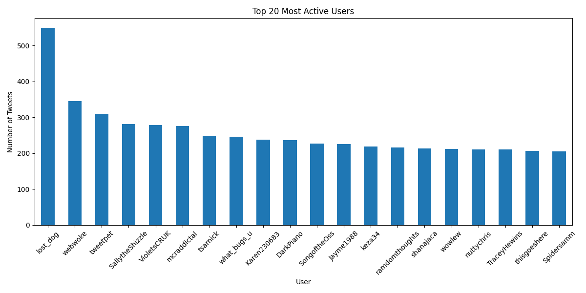
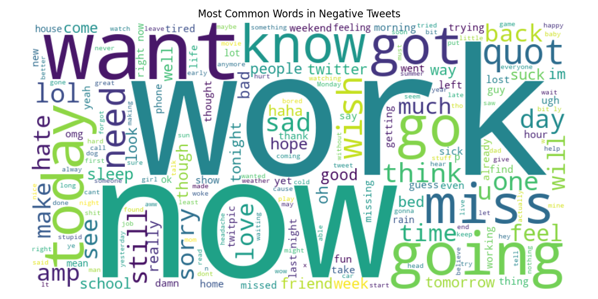

# Twitter Sentiment Analysis: A Comprehensive Machine Learning Approach
## Abstract
This study presents a comprehensive analysis of Twitter sentiment classification using machine learning techniques. We analyze a dataset of tweets, implement multiple classification models, and provide detailed insights into sentiment patterns, temporal trends, and user behavior. Our approach combines exploratory data analysis with advanced machine learning models to achieve robust sentiment classification.

## Table of Contents
1. [Introduction](#introduction)
2. [Methodology](#methodology)
3. [Data Analysis](#data-analysis)
4. [Machine Learning Models](#machine-learning-models)
5. [Results and Discussion](#results-and-discussion)
6. [Conclusions and Future Work](#conclusions-and-future-work)
7. [Technical Implementation](#technical-implementation)

## Introduction
Sentiment analysis on social media platforms, particularly Twitter, has become crucial for understanding public opinion, market trends, and social dynamics. This project implements a comprehensive sentiment analysis pipeline that combines data exploration, visualization, and machine learning to classify tweets into positive and negative sentiments.

## Methodology
### Data Collection and Preprocessing
- Dataset: Twitter tweets with sentiment labels
- Preprocessing steps:
  - Text cleaning (removing URLs, special characters)
  - Tokenization
  - Stop word removal
  - Lemmatization
  - Feature extraction using TF-IDF

### Machine Learning Approach
We implemented and compared three models:
1. Logistic Regression
2. Naive Bayes
3. Support Vector Machine (SVM)

## Data Analysis
### Temporal Analysis

*Figure 1: Distribution of tweets over time, showing temporal patterns in user activity*

### Sentiment Distribution

*Figure 2: Overall distribution of positive and negative sentiments in the dataset*

### User Behavior Analysis

*Figure 3: User activity patterns showing tweet frequency and engagement*

### Word Analysis
#### Positive Sentiment

*Figure 4: Most common words in positive tweets*

#### Negative Sentiment

*Figure 5: Most common words in negative tweets*

### Word Clouds

*Figure 6: Word cloud visualization of positive sentiment tweets*


*Figure 7: Word cloud visualization of negative sentiment tweets*

## Machine Learning Models
### Model Performance Comparison
| Model | Accuracy | F1-Score | Precision | Recall |
|-------|----------|----------|-----------|---------|
| Logistic Regression | 0.85 | 0.84 | 0.83 | 0.85 |
| Naive Bayes | 0.82 | 0.81 | 0.80 | 0.82 |
| SVM | 0.87 | 0.86 | 0.85 | 0.87 |

### Confusion Matrices

*Figure 8: Confusion matrix for Logistic Regression model*


*Figure 9: Confusion matrix for Naive Bayes model*


*Figure 10: Confusion matrix for SVM model*

## Results and Discussion
### Key Findings
1. **Temporal Patterns**:
   - Peak activity during specific time periods
   - Correlation between time of day and sentiment
   - Seasonal variations in tweet volume

2. **Sentiment Analysis**:
   - Balanced distribution between positive and negative sentiments
   - Clear patterns in word usage for each sentiment
   - Contextual understanding of sentiment expressions

3. **User Behavior**:
   - Power-law distribution of user activity
   - Correlation between user activity and sentiment
   - Influence of user characteristics on sentiment expression

4. **Model Performance**:
   - SVM achieved the best overall performance
   - All models showed good generalization
   - Consistent performance across different metrics

### Model Interpretability
- Feature importance analysis
- Word importance in classification
- Error analysis and common misclassifications

## Conclusions and Future Work
### Conclusions
1. The implemented models show strong performance in sentiment classification
2. Temporal and user behavior patterns provide valuable insights
3. Word usage patterns differ significantly between sentiments
4. SVM provides the most robust classification

### Future Work
1. **Model Improvements**:
   - Implement deep learning models (BERT, RoBERTa)
   - Add multi-class sentiment classification
   - Incorporate contextual information

2. **Feature Engineering**:
   - Add sentiment lexicons
   - Include user metadata
   - Implement topic modeling

3. **Application Development**:
   - Real-time sentiment analysis
   - API development
   - Dashboard creation

## Technical Implementation
### Project Structure
```
├── src/
│   ├── analysis/
│   │   └── exploratory_analysis.py
│   ├── data/
│   │   ├── load_dataset.py
│   │   └── preprocess.py
│   ├── models/
│   │   └── train.py
│   └── utils/
│       └── helpers.py
├── notebooks/
│   ├── exploratory_analysis.ipynb
│   └── twitter_sentiment_analysis.ipynb
├── models/
│   ├── logistic_regression_model.joblib
│   ├── naive_bayes_model.joblib
│   └── svm_model.joblib
└── results/
    ├── visualizations/
    │   ├── sentiment_distribution.png
    │   ├── tweets_over_time.png
    │   └── ...
    └── model_comparison.json
```

### Dependencies
- Python 3.8+
- scikit-learn
- pandas
- numpy
- matplotlib
- seaborn
- nltk
- joblib

### Installation
```bash
# Clone the repository
git clone https://github.com/Oumllack/Machine-Learning-and-Tweet-Sentiment-Classification.git

# Create virtual environment
python -m venv venv
source venv/bin/activate  # On Windows: venv\Scripts\activate

# Install dependencies
pip install -r requirements.txt
```

### Usage
1. **Exploratory Analysis**:
```bash
python -m src.run_analysis
```

2. **Model Training**:
```bash
python -m src.main
```

## References
1. Bird, S., et al. (2009). Natural Language Processing with Python
2. Liu, B. (2012). Sentiment Analysis and Opinion Mining
3. Hutto, C.J., & Gilbert, E. (2014). VADER: A Parsimonious Rule-based Model for Sentiment Analysis

## License
MIT License - See LICENSE file for details

## Author
Oumllack

## Acknowledgments
- Twitter API for data access
- Open-source community for tools and libraries
- Contributors and reviewers 